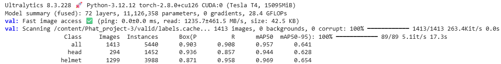

### **Hệ thống giám sát an toàn lao động trong công trường kết hợp YOLO V8 **

#### **Mục tiêu**: phát hiện và cảnh báo người không mang mũ bảo hộ vào cổng công trình, mục tiêu giảm sự phụ thuộc của con người khi rà soát người ra đảm bảo an toàn lao dộng, tiết kiệm nhân lực.
#### **Quy trình thực hiện dự án**:
##### Xác định vấn đề và bài toán: 
tình huống: mỗi khi có người ra vào công trình, cần có người rà soát xem người đó có đội mũ bảo hộ, đảm bảo an toàn lao dộng hay không, thay vào đó, hệ thống sử dụng camera vừa đảm bảo giảm nhân sự rà soát, đồng thời có thể thêm tính năng khi có người vi phạm lập tức phát loa cảnh báo, gởi hình ảnh cho ban quản lý an toàn lao động xử lý.
#####
##### phát triển model
###### - Thu thập dữ liệu: nguồn: Roboflow
###### - Anotation: ( vì bộ dữ liệu free nên chưa sạch và anotation chưa chuẩn nên cần kiểm tra và đánh nhãn lại)
###### - Thống kê và tìm hiểu dữ liệu: 
###### - Tăng cường dữ liệu:
###### - Training:
###### - Đánh giá mô hình:

#### **Lưu ý**: vì anotation tương đối chuẩn và dể phân biệt nên quá trình huấn luyện chỉ thực hiện với 20 epochs
#### Demo
[<video width="480" controls>
  <source src="https://raw.githubusercontent.com/phatnguyen-DS/Construction-safety-yolov8/main/Images_Video/videoplayback.mp4" type="video/mp4">
</video>](https://github.com/user-attachments/assets/cc7f7ecf-a182-4bd9-82b2-74a64979732a)

#### Hiệu suất

